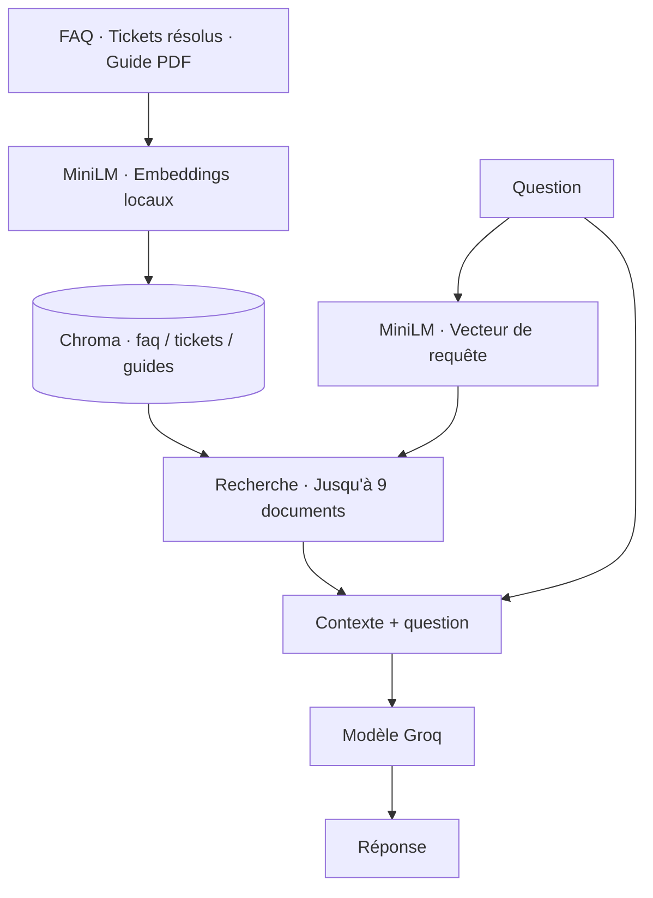

# Telecom Chatbot

Un assistant RAG pour le support télécom : il recherche dans les FAQ, les
tickets résolus et le guide utilisateur, puis utilise ces extraits pour
répondre aux questions sur la connexion, la facturation, la SIM et le roaming.

**LangChain · Chroma · Sentence Transformers · Groq · Streamlit**

[Retour au dépôt](../README.md) · [Démarrage](#démarrage) · [Vérifications](#vérifications) · [Dépannage](#dépannage)

## Fonctionnement

L'ingestion construit l'index local. À chaque question, le chatbot récupère
jusqu'à trois documents par collection et les transmet au modèle avec la question.



| Composant | Configuration |
| --- | --- |
| Embeddings | `sentence-transformers/all-MiniLM-L6-v2` · 384 dimensions |
| Réponses | `qwen/qwen3.8-27b` par défaut · variable `GROQ_CHAT_MODEL` |
| Index persistant | `11_project_telecom_chatbot/chroma_store/` |
| Interfaces | Streamlit avec réponse progressive · terminal interactif |

Le modèle d'embeddings et ses paramètres par défaut sont identiques à ceux du
[notebook RAG](../4_rag_basics/rag.ipynb). L'ingestion et la recherche partagent
la même configuration dans [config.py](config.py).

## Sources incluses

| Collection | Fichier | Documents attendus |
| --- | --- | --- |
| `faq` | [faq.csv](data/faq.csv) | 25 FAQ · une ligne par document |
| `tickets` | [tickets.db](data/tickets.db) | 19 tickets résolus · un ticket par document |
| `guides` | [telecom_guide.pdf](data/telecom_guide.pdf) | 37 fragments issus de 9 pages |

Le ticket escaladé est exclu de l'index. Le PDF est découpé en fragments de
600 caractères au maximum, avec un chevauchement cible de 100 caractères.
Les nombres ci-dessus correspondent aux sources fournies ; `check_setup.py`
les recalcule si les fichiers changent.

## Démarrage

Les commandes suivantes sont destinées à **PowerShell**, depuis la **racine
du dépôt** — le dossier contenant `4_rag_basics` et `11_project_telecom_chatbot`.
Elles utilisent la `.venv` commune en Python 3.14, sans activation préalable.

### 1. Préparer l'environnement

Pour une installation neuve :

```powershell
uv sync
```

Ajoutez votre clé au `.env` de la racine, ou conservez celle déjà configurée :

```dotenv
GROQ_API_KEY=your_groq_key

# Facultatif : remplace le modèle de réponses par défaut
GROQ_CHAT_MODEL=qwen/qwen3.8-27b
```

L'ordre de priorité est : **variables du processus → `.env` du chatbot →
`.env` de la racine**. Le fichier [.env.example](.env.example) sert de modèle
si vous souhaitez une configuration propre au chatbot.

Seules les réponses nécessitent Groq. L'ingestion calcule les embeddings
localement ; le premier chargement de MiniLM peut télécharger les poids.
Le [modèle est public](https://huggingface.co/sentence-transformers/all-MiniLM-L6-v2) :
un jeton Hugging Face est facultatif, et aucune clé Google n'est utilisée.

### 2. Vérifier avant d'ingérer

```powershell
.\.venv\Scripts\python.exe -X utf8 .\11_project_telecom_chatbot\check_setup.py --embeddings
```

Ce contrôle vérifie la syntaxe, les dépendances présentes, la concordance
avec le modèle du notebook 04, la lecture des trois sources et la production
d'un vecteur de 384 dimensions. Il ne crée pas l'index et n'appelle pas Groq.

### 3. Construire l'index

Lancez chaque commande séparément et attendez sa réussite avant la suivante :

```powershell
.\.venv\Scripts\python.exe -X utf8 .\11_project_telecom_chatbot\ingest_faq.py
.\.venv\Scripts\python.exe -X utf8 .\11_project_telecom_chatbot\ingest_tickets.py
.\.venv\Scripts\python.exe -X utf8 .\11_project_telecom_chatbot\ingest_pdf.py
```

Résultat attendu avec les données fournies : **25 FAQ, 19 tickets, 37 fragments**.
Chroma conserve les vecteurs sur disque ; aucun serveur de base de données
séparé n'est nécessaire.

### 4. Tester une réponse réelle

```powershell
.\.venv\Scripts\python.exe -X utf8 .\11_project_telecom_chatbot\check_setup.py --live
```

Ce contrôle vérifie les identifiants attendus dans les collections, la
recherche dans les trois sources, l'accès au modèle Groq et une réponse à
`How do I activate international roaming?`. Il utilise votre quota Groq
et ne relance pas l'ingestion.

### 5. Ouvrir le chatbot

**Interface web**

```powershell
.\.venv\Scripts\python.exe -m streamlit run .\11_project_telecom_chatbot\app.py
```

Ouvrez **http://localhost:8501**. La barre latérale propose des questions
d'exemple. Utilisez `Ctrl+C` dans le terminal pour arrêter le serveur.

**Interface en ligne de commande**

```powershell
.\.venv\Scripts\python.exe -X utf8 .\11_project_telecom_chatbot\main.py
```

Tapez une question, puis Entrée. Tapez `quit` pour quitter.

## Vérifications

Choisissez le contrôle adapté à votre étape :

| Commande après `check_setup.py` | Ce qu'elle vérifie | Appel Groq |
| --- | --- | --- |
| Sans option | Syntaxe, versions installées, modèle de référence et sources | Non |
| `--embeddings` | Contrôles de base + chargement de MiniLM et encodage | Non |
| `--retrieval` | Contrôles de base + identifiants de l'index et recherche | Non |
| `--live` | Contrôles de recherche + accès au modèle et réponse RAG | Oui |

Pour tester l'index sans générer de réponse :

```powershell
.\.venv\Scripts\python.exe -X utf8 .\11_project_telecom_chatbot\check_setup.py --retrieval
```

Pour exécuter les tests de régression hors ligne :

```powershell
.\.venv\Scripts\python.exe -X utf8 -m unittest discover -s .\11_project_telecom_chatbot -p test_telecom.py -v
```

Les tests simulent Chroma : ils vérifient notamment les chemins, les
identifiants, le comportement après une erreur d'embedding et la recherche
dans les trois collections. Ils ne téléchargent aucun modèle, ne créent
aucun index et ne font aucun appel à Groq.

## Mettre à jour les données

Modifiez un fichier source, puis relancez uniquement son script d'ingestion.
Les identifiants stables permettent de mettre à jour les documents sans
ajouter de doublons. Après une écriture réussie, les identifiants qui ne
figurent plus dans la source sont retirés de la collection correspondante.

Une source vide ou des identifiants invalides sont rejetés avant l'écriture.
L'ingestion ne modifie pas les fichiers sources. Relancez ensuite
`check_setup.py --retrieval` pour contrôler l'index.

## Repères dans le code

| Fichier | Rôle |
| --- | --- |
| [config.py](config.py) | Chemins absolus, chargement des variables et modèles partagés |
| [ingest_faq.py](ingest_faq.py), [ingest_tickets.py](ingest_tickets.py), [ingest_pdf.py](ingest_pdf.py) | Lecture et préparation des documents |
| [vector_store.py](vector_store.py) | Mise à jour des collections et retrait des identifiants obsolètes |
| [retriever.py](retriever.py) | Recherche dans les trois collections à partir d'un même vecteur de requête |
| [rag_chain.py](rag_chain.py) | Assemblage du contexte, du prompt et du modèle Groq |
| [app.py](app.py), [main.py](main.py) | Interfaces web et terminal |
| [check_setup.py](check_setup.py), [test_telecom.py](test_telecom.py) | Contrôles de configuration et tests de régression |

## Dépannage

| Symptôme | Action |
| --- | --- |
| `ModuleNotFoundError` ou Python introuvable | Revenez à la racine du dépôt, lancez `uv sync` et utilisez sa `.venv`. |
| Index absent, collection vide ou incomplète | Lancez les trois ingestions, puis `check_setup.py --retrieval`. |
| `model_not_found` | Vérifiez `GROQ_CHAT_MODEL` et les variables prioritaires ; consultez les [modèles Groq](https://console.groq.com/docs/models). |
| Clé Groq absente ou refusée | Vérifiez `GROQ_API_KEY` et qu'un `.env` local ne remplace pas votre clé par une valeur d'exemple. |
| Échec du chargement de MiniLM | Vérifiez l'accès à Hugging Face pour le premier téléchargement, puis relancez `--embeddings`. |
| Port 8501 déjà utilisé | Arrêtez l'autre app, ou ajoutez `--server.port 8502` à la commande Streamlit et ouvrez le port 8502. |

Chaque question est traitée indépendamment : l'historique affiché dans
Streamlit n'est pas envoyé au modèle. Le prompt demande de répondre à partir
du contexte fourni et d'orienter vers le support lorsque celui-ci est insuffisant.
